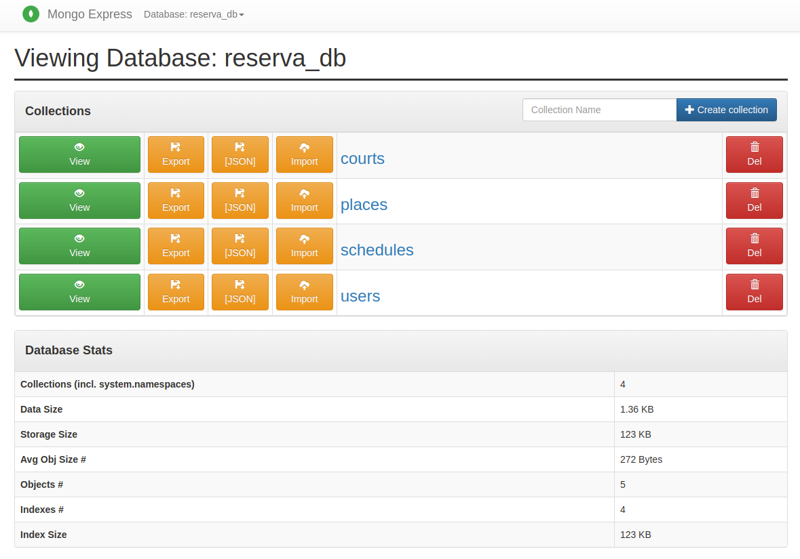
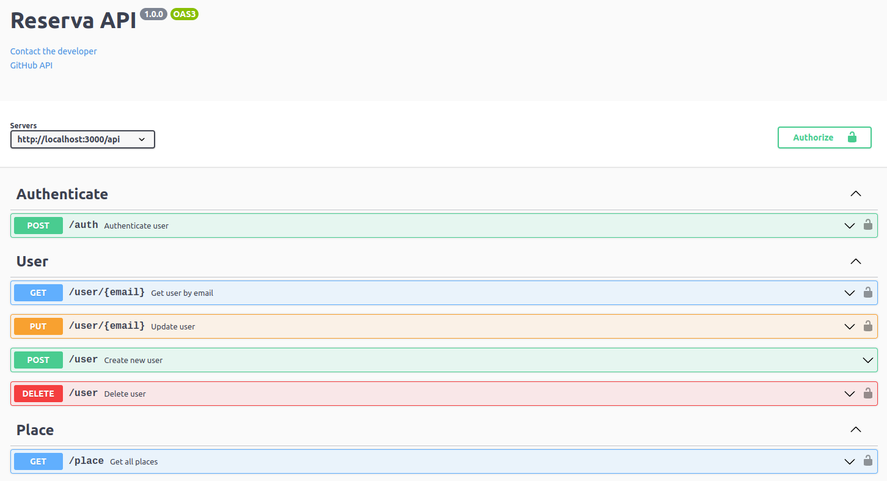

# API REST Reserva de quadras

## Descrição do projeto
<p> O projeto contempla a criação de uma API REST utilizando o modelo de Clean Architecure e Clean Code para reserva de quadras esportivas possuindo endpoints para cadastro de usuários e autenticação dos mesmos utilizando JWT, cadastro de locais, quadras e horários além de reserva de horários em quadras e locais especificos. Para a construção do projeto foram utilizadas ferramentas como NodeJS com TypeScript e expressJS, banco de dados mongoDB com docker para subida da aplicação em containers além de uma documentação completa com swagger para fácil acesso as requisições e payloads da aplicação</p>

## Features
### Autenticação
- Autenticação na aplicação com token JWT
- Usuário autentica com email e senha
### Usuários
- Cadastro de um novo usuário
    - Quando um novo usuário for cadastrado vai receber o token de autenticação automaticamente para continuar a fazer outras requisições na página
    - Possui validações de CPF, email, telefone e demais campos    
- Listagem de um usuário pelo seu email
- Atualização das informações de um usuário
- Exclusão de um usuário
### Locais
- Cadastro de um novo local
    - O cadastro de um novo local pode contar com quadras inicialmente ou podem ser cadastradas posteriormente
    - Possui validações de CNPJ, CEP e demais campos
- Listagem de um local pelo nome
- Listagem de todos os locais cadastrados
- Atualização das informações de um local
- Exclusão de um local
### Quadras
- Cadastro de um nova quadra
    - O cadastro de um nova quadra sempre vai estar conectado a um local que a quadra pertence pelo nome do local
    - As quadras possuem horarios que são criados posteriormente pelo endpoint de "schedules"
- Listagem de quadras pelo id
- Atualização do nome de uma quadra
- Exclusão de uma quadra
### Horários
- Cadastro de um novo horário
    - O cadastro de um novo horário vai pertencer a uma quadra e deve respeitar as validações de horário do local, sendo possível cadastrar um horário a cada hora
    - O horário possui sempre vai pertencer a uma determinada quadra, e após ele ser reservado vai pertencer ao usuário que reservou
- Listagem de horários pelo id
- Exclusão de um horário
- Reserva de um horário
    - A reserva de horário é feita por um usuário e assim aquele horário vai pertencer a ele e possuir a "flag" de reservado como verdadeiro e os campos de email, nome e id serão preenchidos com as informações do usuario que reservou o horário
- Desmarcar um horário
    - O usuário que reservou um horário pode desmarcar ele respectivamente, o horário vai voltar a possuir a "flag" de reservado como falso e os campos de email, nome e id do usuário que tinha reservado voltam ficar nulos

## Instalação local
Para instalação local é preciso trocar o DATABASE_URL no arquivo .env para a URL do mongoDB da sua máquina, as collections serão geradas automaticamente pelo mongoose, é necessário ter o mongoDB instalado na máquina ou utilizar o mongoDB Atlas para acessar o banco de dados<br>

Instalar dependências
```bash
npm install
```

Compilar o projeto <br>
```bash
npm run build
```

Executar aplicação <br>
Após a compilação o arquivo compilado de TS para JS vai ser criado na pasta "/dist" e assim disponível para execução
```bash
npm run start
```

Localmente a API pode ser inicializada com o comando de desenvolvimento onde não é feita a compilação do código TypeScript
```bash
npm run dev
```
> API estará disponível na URL http://localhost:3000

## Instalação com docker
Para a conexão com o banco de dados no arquivo .env trocar o host da URL para "db" assim vai se conectar com o serviço "db" de banco de dados mongoDB criado pelo docker.<br>
O projeto possui o arquivo "docker-compose" este arquivo faz as configurações de todos os containers docker que vão ser criados.
 - Container API
 - Container mongoDB
 - Containter mongo-express
    - O mongo express permite acesso ao banco de dados de forma simplicada para visualizar as colections e seus dados
<div align="center"></div>

Subir os containers docker
```bash
docker compose up --build
```
> API estará disponível na URL http://localhost:3000<br>
> O mongo-express estará disponível na URL http://localhost:8081

## Swagger
O swagger foi implementado no projeto assim sendo possível realizar requisições e visualizar os payloads de cada entidade que a aplicação possui facilmente<br>
> O swagger estará disponível na URL http://localhost:3000/swagger
<div align="center"></div>

## Testes
- Os testes de integração foram implementados utilizando o framework Jest, testando todos os endpoints e serviços da aplicação integrados<br>
- É necessário ter o mongoDB instalado localmente, ativo e utilizar o host local na URL "127.0.0.1" no ".env.local"
```bash
npm run test:integration
```
> Os testes serão rodados localmente e os resultados mostrados, os testes de integração chamam os endpoints assim testando o fluxo e funcionamento completo de cada um deles
